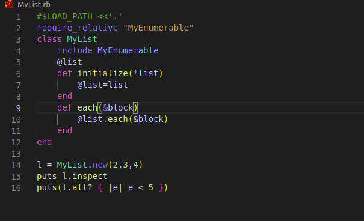

# Enumerable

This project is all about learning ruby at Microverse. We are wrote a program that tests some conditions in a list.

Additional description about the project and its features.

## Built With

- Ruby

## Getting Started

- git clone git@github.com:azy64/enumarable.git
- cd enumarable

## RUN THE APPLICATION

- ruby MyList.rb

## Authors

👤 **Author1**

- GitHub: [@azy64](https://github.com/azy64)
- LinkedIn: [LinkedIn](https://www.linkedin.com/in/azaria-saidi-524780112/)

👤 **Author2**

- GitHub: [@Tchilo](https://github.com/Tchilo)

## 🤝 Contributing

Contributions, issues, and feature requests are welcome!

Feel free to check the [issues page](../../issues/).

## Show your support

Give a ⭐️ if you like this project!

## Acknowledgments

- Hat tip to anyone whose code was used
- Inspiration
- etc

## 📝 License

This project is [MIT](./MIT.md) licensed.